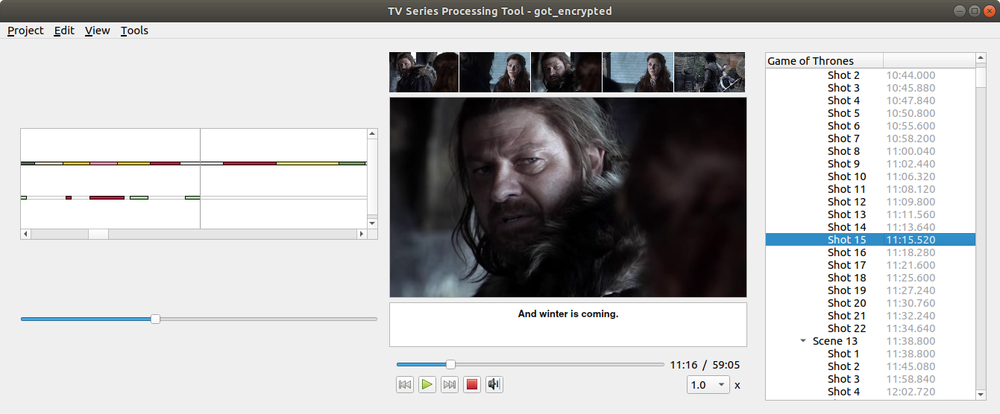

# TV-Series-Processing-Tool

*TV Series Processing Tool* is a small software I coded in C++/Qt during my PhD to annotate, visualize and process data related to three TV shows: *Breaking Bad*, *Game of Thrones* and *House of Cards*.

As shown on the folllowing screenshot, the software includes a basic video playing interface, along with a set of tools to visualize and automatically extract information from the video stream: shot boundaries, speaker clustering (disabled in this public version), interacting speakers... *TV Series Processing Tool* also provides the users with basic annotation capabilities: speaker turns, interlocutors, shot and scene boundaries, recurring shots.
 
 
 

 
 
 
